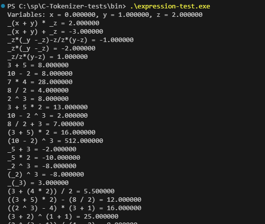
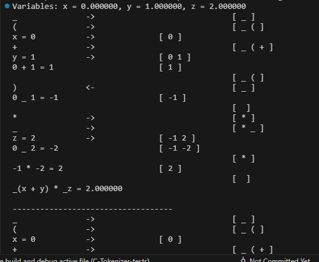

This is a standard C implementation of Shunting-yard algorithm, with support for unary operstions and operation association and parenthesis.

> expression-test

By using using debug as the first parameter you can see a full debug of the algorithm steps, stack values and operations:

> expression-test debug

